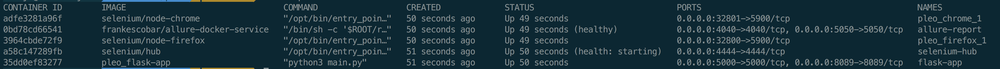
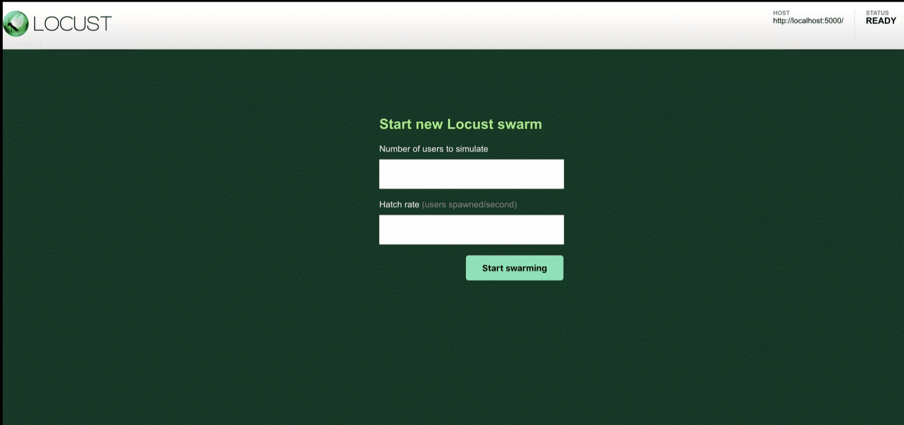
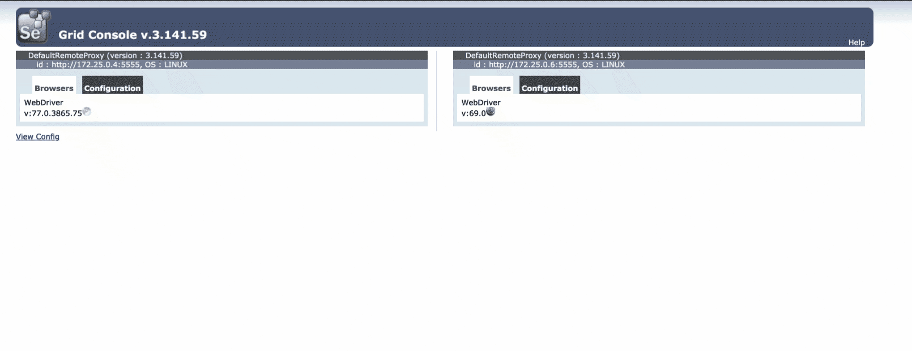
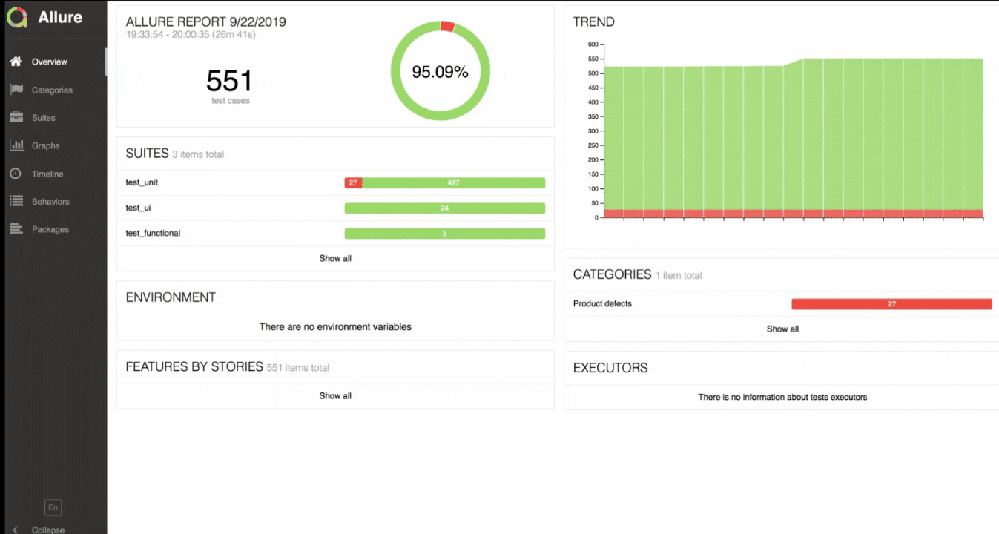

# Format Number
A [`python`](https://www.python.org/downloads/) application created using [`flask`](https://www.fullstackpython.com/flask.html) which takes a number as input and gives a formatted number as output based on sepecific rule.

Example: `2310000.159897` => `'2 310 000.16'`

## Project Structure Overview
```
|-- root(pleo_assignment)
    |-- [+] src                     # main app code is here
    |-- [+] tests                   # tests are here
        |-- [+] test_functional
        |-- [+] test_ui
        |-- [+] test_unit
        |-- [+] test_load
        |-- [+] reports             # contains test report
        |-- [+] schemas             # response json schema 
        |-- conftest.py             # shares test fixtures
        |-- pytest.ini              # basic test configs
    |-- instance                    # different app configs
    |-- main.py                     # entrypoint to run app
    |-- requirements.txt            # all app dependencies
    |-- docker-compose.yml          # to spawn containers
    |-- dockerfile
    |-- wait-for-grid.sh            # selenium-grid check
```


##  Steps to run the project

### 1. Using [`Docker`](https://docs.docker.com/docker-for-mac/install/):
```sh
# install docker first and then
$ docker-compose up
#check the containers
$ docker ps
```
It should display following container


go to `http://localhost:5000/` to see the app


### To run `load test`:
```
$ docker exec -ti flask-app locust -f tests/test_load/*.py --host http://localhost:5000
```
Now, open `http://localhost:8089` in browser. You will get the locust web ui to run load tests.



### To run `unit test`:
```sh
$ docker exec -ti flask-app pytest tests/test_unit/*.py
```

### To run `functional test`:
```sh
$ docker exec -ti flask-app pytest tests/test_functional/*.py
```

### To run `ui test`:
```sh
$ docker exec -ti flask-app sh wait-for-grid.sh pytest tests/test_ui/test_home.py
```
check  `selenium hub` ui at `http://localhost:4444/grid/console`



### To view `test run reports`:
Open `http://localhost:4040` to access allure-report webpage




### 2. Without docker (in local machine)
### To run app:

```sh
# install python 3
$ cd pleo_assignment
$ pip install -r requirements.txt
$ export PYTHONPATH="$PYTHONPATH:/pleo_assignment/"
$ export FLASK_ENV=development #oneof(production|testing|development)
$ export APP_SETTINGS=development #oneof(development|testing|staging|production)
$ export FLASK_APP=main.py
$ flask run
```
go to `http://localhost:5000/` to see the app

### To run the `unit, functional, ui, and load tests`
```sh 
$ cd pleo_assignment
#unit          
$ pytest tests/test_unit/*.py 
#functional
$ pytest tests/test_functional/*.py 
#ui
$ sh wait-for-grid.sh pytest tests/test_ui/*.py
#load
$ locust -f tests/test_load/*.py --host http://localhost:5000
```

## Testing Approach
* The project has different types of tests written using [`pytest`](https://docs.pytest.org/en/latest/), a python based test framework.

* All the tests make use of [`property based testing approach`](https://hypothesis.works/articles/what-is-property-based-testing/) implemented using [`hypothesis`](https://hypothesis.readthedocs.io/en/latest/).

* `Test Data` is provided to the tests using a mix of `hardcode values`, `hypothesis` and [`naughty-string-validator`](https://pypi.org/project/naughty-string-validator/). Hypothesis makes sure that the test is run against a large range of test data and in `randomized order`.
Naughty strings helps in detecting any corner cases.

* `Unit and functional tests` also makes use of inbuilt flask testing modules to validate routes. `json schema validation` is implemented for api tests.

* `UI Tests` are implemented using `selenium` in [`Page Object Model`](https://github.com/SeleniumHQ/selenium/wiki/PageObjects) architecture which separates locators, functions and tests and assures minimum changes to maintain tests on ui change of project.

* To run `UI tests` in `distributed` mode, the project has implemented [`selenium-grid`](https://github.com/SeleniumHQ/selenium/wiki/Grid2) which gives several browser node to run tests simultaneously. It can be extended to run tests in `parallel` mode as well.

* To run `Load tests`, the project implements [`locust`](https://locust.io/)

* The project uses file `conftest.py` to share `test data` in the form of `test fixtures` and `configuration` among all the tests.

* All the test run reports are stored a `reports` folder which is being pinged by the `allure-report` service continuously where the reports can be seen along with the previous history

* Keeping `Continuous Integration and Testing` in mind, entire project is `dockerized`. The docker containers can be configured to be spawned using tools like `jenkins` on code change to run tests.

* The test implementes following features as well:

    * [`pytest-xdist`](https://pypi.org/project/pytest-xdist/) to support parallel runs
    * [`code coverage`](https://pypi.org/project/pytest-cov/) report
    ```
            ---------- coverage: platform darwin, python 3.6.4-final-0 -----------
        Name                                Stmts   Miss  Cover
        -------------------------------------------------------
        instance/__init__.py                    0      0   100%
        instance/config.py                     16      0   100%
        main.py                                 6      6     0%
        src/__init__.py                         7      0   100%
        src/app.py                             21      1    95%
        src/utils.py                           25      9    64%
        tests/conftest.py                      75     27    64%
        tests/test_functional/test_app.py      40      0   100%
        -------------------------------------------------------
        TOTAL                                 190     43    77%
    ```
    * `flaky` support to re-run tests n-times on failure

### Future Tasks-

* Add more tests of each category.
* Add some css to the ui to beautify it.
* Implement mocking in unit tests to isolate some components while testing.
* Integrate jenkins to schedule tests and builds


